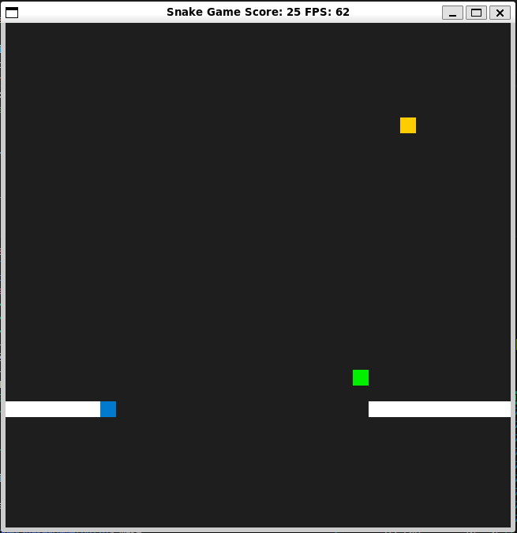
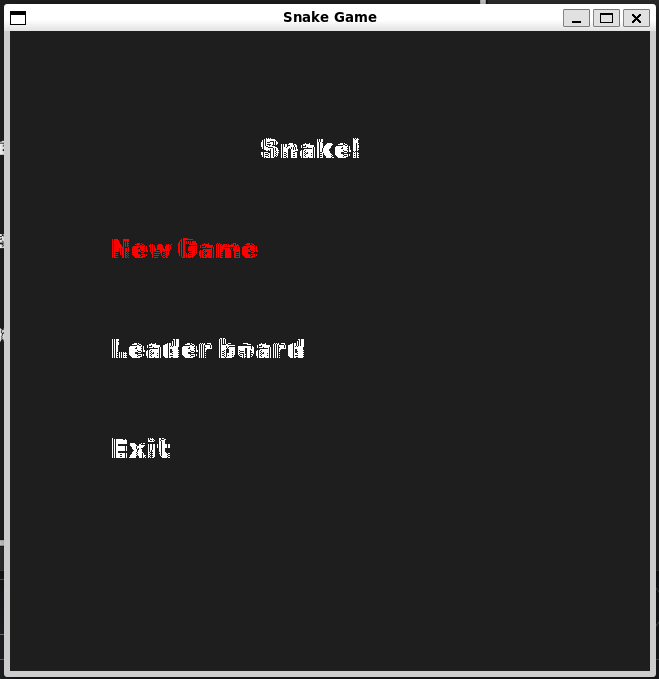
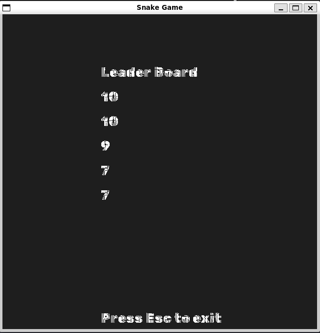
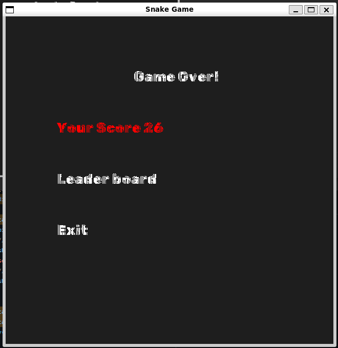
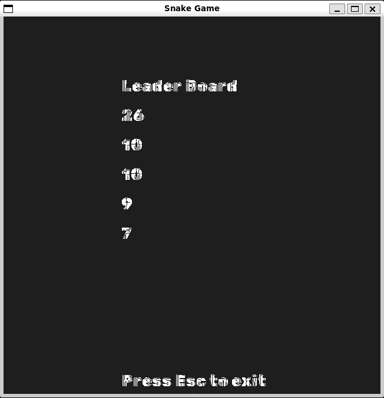

# CPPND: Capstone Snake Game Project
This is the Capstone project in the [Udacity C++ Nanodegree Program](https://www.udacity.com/course/c-plus-plus-nanodegree--nd213). The code for this repo was inspired by [this](https://codereview.stackexchange.com/questions/212296/snake-game-in-c-with-sdl) excellent StackOverflow post and set of responses.

As we can see in the GIF below, the core of the game is kept as is.

## Improvements Made:
- Added Bonus Food (in green) that appears after eating 5 normal fruits for 10 seconds and increases the score without affecting the snake length.

  
- Added Menu to the game screen

  
- Added Leader Board of Top 5 records

  
- Score is shown after the game is over

  
- New Score is logged in the Leader board 

  

## Dependencies for Running Locally
* cmake >= 3.7
  * All OSes: [click here for installation instructions](https://cmake.org/install/)
* make >= 4.1 (Linux, Mac), 3.81 (Windows)
  * Linux: make is installed by default on most Linux distros
  * Mac: [install Xcode command line tools to get make](https://developer.apple.com/xcode/features/)
  * Windows: [Click here for installation instructions](http://gnuwin32.sourceforge.net/packages/make.htm)
* SDL2 >= 2.0
  * All installation instructions can be found [here](https://wiki.libsdl.org/Installation)
  >Note that for Linux, an `apt` or `apt-get` installation is preferred to building from source. 
* SDL2_ttf >= 2.0
  * All installation instructions can be found [here](https://wiki.libsdl.org/SDL2_ttf/FrontPage)
  >Note that for Linux, an `apt` or `apt-get` installation is preferred to building from source.
  Typical installation command for APT package manager is `sudo apt-get install libsdl2-ttf-dev`
* gcc/g++ >= 5.4
  * Linux: gcc / g++ is installed by default on most Linux distros
  * Mac: same deal as make - [install Xcode command line tools](https://developer.apple.com/xcode/features/)
  * Windows: recommend using [MinGW](http://www.mingw.org/)

## Basic Build Instructions
1. Clone this repo.
2. Make a build directory in the top level directory: `mkdir build && cd build`
3. Compile: `cmake .. && make`
4. Run it: `./SnakeGame`.

## Rubrics

### Loops, Functions, I/O (2 Required)
- C++ functions and control structures
  - Functions and control structures can be found everywhere in the project.
- File Manipulation.
  - File manipulations can be found in `LeaderBoard.c` where the `LeaderBoard.txt` file is read from and written to.
- The project uses data structures and immutable variables.
  - Game has been restructured to be more SOLID which introduces new mutable and immutable structures for example in `IScreen.h` as well as `util.h` and `util.cpp` files.

### Object Oriented Programming (3 required)
- One or more classes are added to the project with appropriate access specifiers for class members.
  - see `ScreenManager.h`, `LeaderBoard.h`, `util.h`, `IScreen.h`, `WelcomeScreen.h`

- Class constructors utilize member initialization lists.
  - see `ScreenManager.cpp`, `LeaderBoard.cpp`, `util.cpp`, `WelcomeScreen.cpp`

- Classes abstract implementation details from their interfaces.
  - see `ScreenManager.h` & `ScreenManager.cpp` as an example 

- Overloaded functions allow the same function to operate on different parameters.
  - see `Renderer::Render()` in `renderer.cpp` line 54 & 63

- Classes follow an appropriate inheritance hierarchy with virtual and override functions.
  - See `ScreenManager.h`, `GameScreen.h` and `IScreen.h`

- Templates generalize functions or classes in the project.
  - See `IScreen.h`, `ScreenManager.h`, `GameScreen.h` and `renderer.h`

### Memory Management (3 Required)
- The project makes use of references in function declarations.
  - See `ScreenManager.h` function `ScreenManager::Start()`.
- The project uses destructors appropriately.
  - See `Controller::~Controller()` in `Controller.cpp`.
- The project uses scope / Resource Acquisition Is Initialization (RAII) where appropriate.
  - see `ScreenManager.cpp`, `LeaderBoard.cpp`, `util.cpp`, `WelcomeScreen.cpp` member variable initialization and constructor overloads of `ScreenItem` class in `util.h`.
- The project uses move semantics to move data instead of copying it, where possible.
  - See `MessageBox.h`.
- The project uses smart pointers instead of raw pointers.
  - See `_keyStrokes` MessageBox pinter in `controller.h`.

### Concurrency (2 required)
- The project uses multithreading.
  - See `controller.h`, `controller.cpp` & `GameScreen.cpp`
- A mutex or lock is used in the project.
  - see `ScreenManager.cpp`, `LeaderBoard.cpp`, `util.cpp`, `GameScreen.cpp` & `WelcomeScreen.cpp`
- A condition variable is used in the project.
  - see `MessageBox.h` & `GameScreen.cpp`
  
## CC Attribution-ShareAlike 4.0 International

Shield: [![CC BY-SA 4.0][cc-by-sa-shield]][cc-by-sa]

This work is licensed under a
[Creative Commons Attribution-ShareAlike 4.0 International License][cc-by-sa].

[![CC BY-SA 4.0][cc-by-sa-image]][cc-by-sa]

[cc-by-sa]: http://creativecommons.org/licenses/by-sa/4.0/
[cc-by-sa-image]: https://licensebuttons.net/l/by-sa/4.0/88x31.png
[cc-by-sa-shield]: https://img.shields.io/badge/License-CC%20BY--SA%204.0-lightgrey.svg
